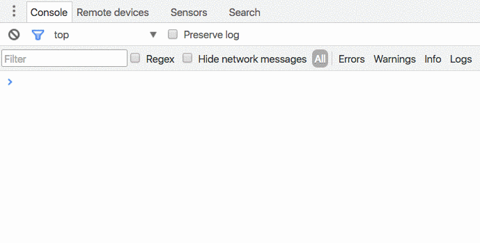

# console.image
A nice snippet to log images in chrome console 🌈


## Why is that ?
This snippet is heavily inspired from [Paul Irish](https://twitter.com/paul_irish) talk at Chrome Dev Summit 2016 on November, 10 2016.

He showed all the new stuff coming in Chrome Devtools in the latest version of Chrome (v55). [Here is the link.](https://www.youtube.com/watch?v=HF1luRD4Qmk)

This is **his** idea. I've only managed to reproduce his output from what I've seen on his snippet. 😉


## Installation

You can use it from npm :

```sh
> npm install console.image
```

then import it into your code :

```js
import 'console.image'
```

And it will add the .image() method on your `console` object in Chrome Devtools.


Otherwise you can [copy the code to your Chrome snippets](#snippet).
## Usage

```js
const avatar_url = 'https://avatars3.githubusercontent.com/u/USER_ID'

console.image(avatar_url)
```
and you get :




## Snippet

Here's the code if you want to store it to your Chrome snippets :

```js
function renderImage (url, scale = 0.3) {
  let img = new Image()

  img.onload = () => {
    const style = `
      display: block !important;
      margin: 10px 0;
      font-size: ${img.height * scale}px;
      padding: ${Math.floor(img.height * scale/2)}px ${Math.floor(img.width * scale/2)}px;
      background: url(${url});
      background-size: ${img.width * scale}px ${img.height * scale}px;
      background-repeat: no-repeat;
      background-position: center;
      background-size: contain;
    `
    console.log('%c', style)
  }

  img.src = url
}

console.image = renderImage
```
